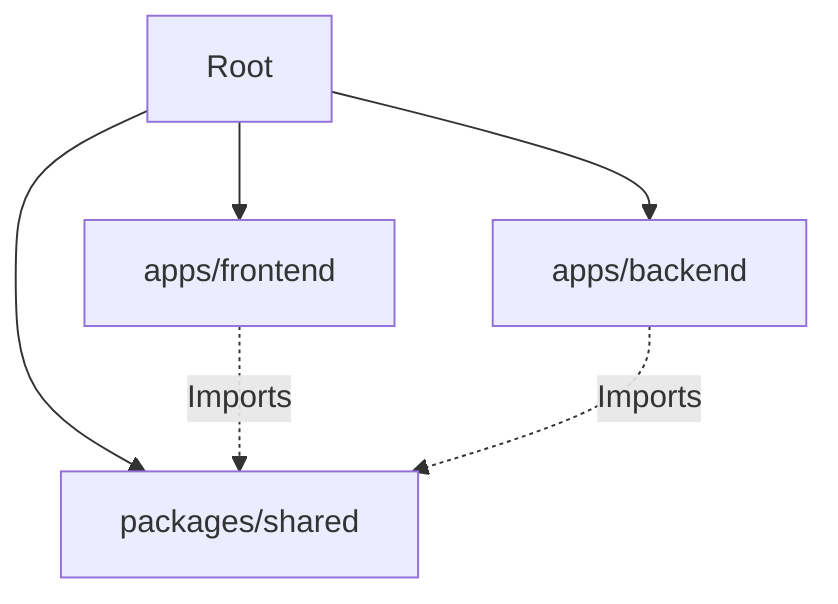

# System Architecture

## Overview

CoFuel Home of Events follows a client-server architecture managed within a monorepo structure. The application is divided into three main workspaces:

1.  **Frontend (`apps/frontend`)**: A Single Page Application (SPA) built with React.
2.  **Backend (`apps/backend`)**: A RESTful API built with Express.js.
3.  **Shared (`packages/shared`)**: Common TypeScript types and utilities shared between frontend and backend.

## Monorepo Structure

We use **NPM Workspaces** to manage dependencies and link packages locally.

## Frontend Architecture

The frontend is built with **React** and **Vite**. It uses a feature-based folder structure.

- **State Management**:
  - **Zustand**: For global client-side state (e.g., user session, UI theme).
  - **TanStack Query (React Query)**: For server state management (caching, fetching, synchronizing).
- **Routing**: **React Router DOM** handles client-side navigation.
- **Styling**: **Mantine UI** provides the component library and theming system. CSS Modules are used for custom component styling.
- **Forms**: **React Hook Form** combined with **Zod** for schema validation.

## Backend Architecture

The backend is a **REST API** built with **Express.js**.

- **Database**: **PostgreSQL** is the primary data store.
- **ORM**: **Prisma** is used for database modeling and queries.
- **Authentication**:
  - **JWT (JSON Web Tokens)** for stateless authentication.
  - **Bcrypt** for password hashing.
- **File Storage**: **AWS S3** is used for storing uploaded images and documents.
- **Validation**: **Zod** is used for request body validation.

## Data Flow

1.  **User Interaction**: User interacts with the React Frontend.
2.  **API Request**: Frontend sends HTTP requests (GET, POST, PUT, DELETE) to the Backend API using Axios.
3.  **Validation**: Backend validates the request data using Zod schemas.
4.  **Business Logic**: Controllers and Services process the request.
5.  **Database Operation**: Prisma interacts with the PostgreSQL database.
6.  **Response**: Backend sends a JSON response back to the Frontend.
7.  **UI Update**: React Query updates the cache, and React re-renders the UI.

## Security

- **Helmet**: Sets secure HTTP headers.
- **CORS**: Configured to allow requests only from trusted origins.
- **Rate Limiting**: Protects against brute-force attacks.
- **Input Sanitization**: Zod validation prevents invalid data from entering the system.
